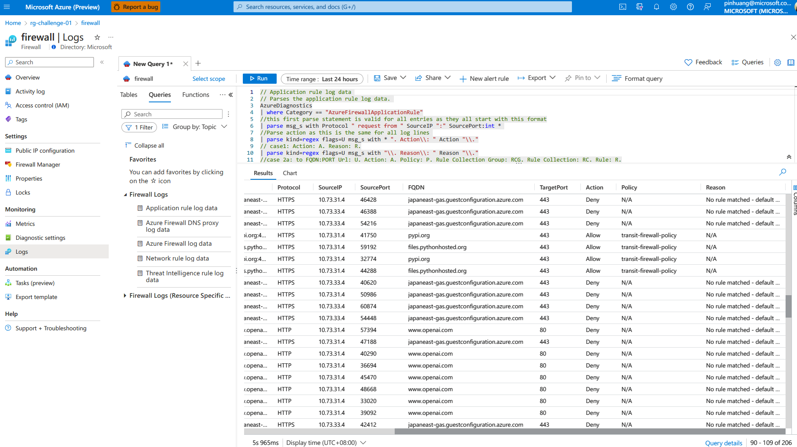

# Challenge 1: Spoke to Spoke via Azure Firewall

- Goal: Create a hub and spoke topology with two spokes connected via Azure Firewall.

- Susccess Criteria
  1. Make sure you access VMs though Azure Bastion
  2. Make sure all VMs cannot use Default outbound access IP
  3. Make sure all VMs can ping each other include Azure Firewall
  4. Make sure all VMs can update and install Ubuntu packages, and deny access to other sites
  5. Make sure all VMs can download source from pypi, github, and deny access to other sites
  6. Azure Firewall logs should be enabled and sent to Log Analytics, and the logs should be queried to show the traffic.

## How to play?

Switch to the challenge directory, and run the following command to create the challenge environment.

``` bash
cd ./challenge
```

## How to validate?

For Success Criteria 1 ~ 5, Please access to VMs through Azure Bastion, and run the following command to validate the success criteria.

``` bash
pytest -p no:cacheprovider -v test-challenge1.py
```

and all tests should pass.

- All pass


For Success Criteria 6, Please access to Azure Portal, and check the following items.



## Known Issues

### Issue 1: Error when creating azurerm_monitor_diagnostic_setting

``` bash
│ Error: creating Monitor Diagnostics Setting "diagnostic-for-firewall" for Resource "/subscriptions//resourceGroups/rg-challenge-01/providers/Microsoft.Network/azureFirewalls/firewall": insights.DiagnosticSettingsClient#CreateOrUpdate: Failure responding to request: StatusCode=400 -- Original Error: autorest/azure: Service returned an error. Status=400 Code="BadRequest" Message="Invalid API version used to modify diagnostic setting with one or more category groups selected: diagnostic-for-firewall, please use version higher than: 2021-05-01-preview"
│
│   with azurerm_monitor_diagnostic_setting.diagnostic-for-firewall,
│   on log-analystics-workspace.tf line 24, in resource "azurerm_monitor_diagnostic_setting" "diagnostic-for-firewall":
│   24: resource "azurerm_monitor_diagnostic_setting" "diagnostic-for-firewall" {
```
